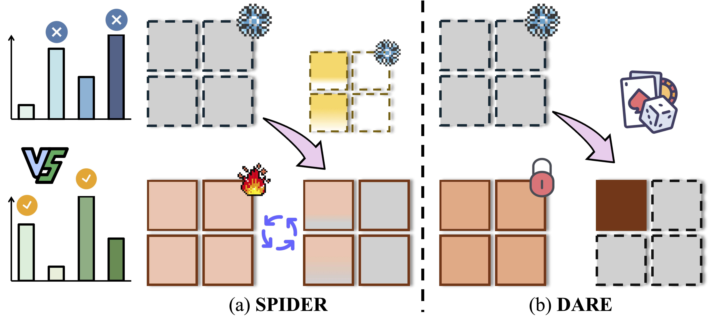

# Learn from Downstream and Be Yourself in Multimodal Large Language Models Fine-Tuning 
> Wenke Huang, Jian Liang, Zekun Shi, Didi Zhu, Guancheng Wan, He Li, Bo Du, Dacheng Tao, Mang Ye

> [[Link]([https://openreview.net/pdf?id=FKqmIAnkrb)], *ICML, 2025*

<!-- <p align="center">
<a href="https://arxiv.org/abs/2411.10928"></a>
<a href="https://github.com/WenkeHuang/Awesome-MLLM-Tuning"></a>
</p> -->

<p align="center">

</p>


## Abstract
Multimodal Large Language Model (MLLM) has demonstrated strong generalization capabilities across diverse distributions and tasks, largely due to extensive pre-training datasets. Fine-tuning MLLM has become a common practice to improve performance on specific downstream tasks. However, during fine-tuning, MLLM often faces the risk of forgetting knowledge acquired during pre-training, which can result in a decline in generalization abilities. To balance the trade-off between generalization and specialization, we propose measuring the parameter importance for both pre-trained and fine-tuning distributions, based on frozen pre-trained weight magnitude and accumulated fine-tuning gradient values. We further apply an importance-aware weight allocation strategy, selectively updating relatively important parameters for downstream tasks. We conduct empirical evaluations on both image captioning and visual question-answering tasks using various MLLM architectures. The comprehensive experimental analysis demonstrates the effectiveness of the proposed solution, highlighting the efficiency of the crucial modules in enhancing downstream specialization performance while mitigating generalization degradation in  MLLM Fine-Tuning.

## 🥳 Citation

If you find this repository helpful for your research, we would greatly appreciate it if you could cite our papers. ✨

```bibtex
@inproceedings{SPIDER_ICML25,
    title={Learn from Downstream and Be Yourself in Multimodal Large Language Models Fine-Tuning},
    author={Wenke Huang and Jian Liang and Zekun Shi and Didi Zhu and Guancheng Wan and He Li and Bo Du and Dacheng Tao and Mang Ye},
    booktitle=ICML,
    year={2025}
}

@misc{MLLMTuning_arXiv25,
      title={Keeping Yourself is Important in Downstream Tuning Multimodal Large Language Model}, 
      author={Wenke Huang, Jian Liang, Xianda Guo, Yiyang Fang, Guancheng Wan, Xuankun Rong, Chi Wen, Zekun Shi,  Qingyun Li, Didi Zhu, Yanbiao Ma, Ke Liang, Bin Yang, He Li, Jiawei Shao, Mang Ye, Bo Du},
      year={2025},
      eprint={2503.04543},
      archivePrefix={arXiv},
      primaryClass={cs.CR}
}

@inproceedings{LiangLoRASculpt_CVPR2025,
    author    = {Liang, Jian and Huang, Wenke and Wan, Guancheng and Yang, Qu and Ye, Mang},
    title     = {LoRASculpt: Sculpting LoRA for Harmonizing General and Specialized Knowledge in Multimodal Large Language Models},
    booktitle = {CVPR},
    year      = {2025},
}
```

## 🔍 Relevant Projects
[1] Keeping Yourself is Important in Downstream Tuning Multimodal Large Language Model - arXiv 2025  [[Link](https://arxiv.org/abs/2503.04543)][[Code](https://github.com/WenkeHuang/Awesome-MLLM-Tuning)]


[2] LoRASculpt: Sculpting LoRA for Harmonizing General and Specialized Knowledge in Multimodal Large Language Models - CVPR 2025 Oral [[Link](https://arxiv.org/abs/2503.16843)][[Code](https://github.com/LiangJian24/LoRASculpt)]
